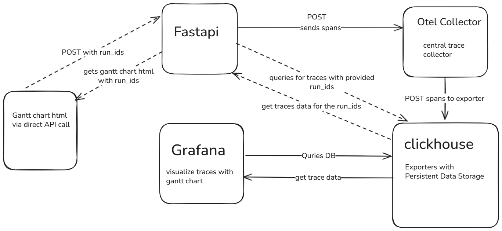

# **Approach Document: OTEL + ClickHouse + Grafana Integration**

## **Objective**
Enable tracing and visualization of `jiva retrieval` execution using **OpenTelemetry**, **ClickHouse**, and **Grafana** with FastAPI integration for Gantt chart generation.

---

## **Architecture Overview**



The flow integrates OTEL tracing into the FastAPI app:

1. **FastAPI** sends spans to **OTEL Collector**.
2. **OTEL Collector** exports traces to **ClickHouse**.
3. **ClickHouse** stores persistent trace data.
4. **FastAPI** exposes APIs to generate downloadable HTML Gantt charts and to delete old traces.
5.  **Grafana** also provides traces visualization as Gantt charts via SQL queries.
---

## **Key Additions**

### **1. Containers Added**
- `otel-collector` – receives OTLP data via gRPC/HTTP and exports to ClickHouse.  
- `clickhouse` – persistent trace storage and querying backend.  
- `grafana` – UI for Gantt chart visualization (port `3010`).
#### **docker-compose.yml**
```yml
services:
  clickhouse:
    build:
      context: ./devtools/clickhouse
      dockerfile: Dockerfile
    container_name: clickhouse
    restart: always
    environment:
      CLICKHOUSE_USER: otel_user
      CLICKHOUSE_PASSWORD: otel_password
      CLICKHOUSE_DB: otel_traces
    ports:
      - "8123:8123"
      - "9000:9000"
    volumes:
      - ./devtools/clickhouse/.clickhouse_data:/var/lib/clickhouse
    ulimits:
      nofile:
        soft: 262144
        hard: 262144
    healthcheck:
      test: ["CMD-SHELL", "clickhouse-client --query='SELECT 1' || exit 1"]
      interval: 5s
      retries: 5

  otel-collector:
    build:
      context: ./devtools/otel-collector
      dockerfile: Dockerfile
    container_name: otel-collector
    ports:
      - "4317:4317"
      - "4318:4318"
    depends_on:
      clickhouse:
        condition: service_healthy

  grafana:
    build:
      context: ./devtools/grafana
      dockerfile: Dockerfile
    container_name: grafana
    restart: unless-stopped
    environment:
      GF_SECURITY_ADMIN_USER: admin
      GF_SECURITY_ADMIN_PASSWORD: admin
    ports:
      - "3010:3000"
    depends_on:
      - clickhouse
    volumes:
      - ./devtools/grafana/.grafana_data:/var/lib/grafana
```
---

### **2. OTEL Collector Integration**
- Configured as a **span exporter** for `trace_provider` in fastapi metrics code.
- The configuration automatically creates the trace tables in clickhouse if it does not exists.
- When Fastapi sends traces to OTEL Collector it exports traces to ClickHouse with a TTL value. When it expires the corresponding traces are deleted permanantly.
- Batch processor added for efficient span delivery.

#### **otel-collector-config.yaml**
```yaml
receivers:
  otlp:
    protocols:
      grpc:
        endpoint: 0.0.0.0:4317
      http:
        endpoint: 0.0.0.0:4318

processors:
  batch:
    timeout: 5s
    send_batch_size: 1000

exporters:
  debug:
    verbosity: detailed
  clickhouse:
    endpoint: "http://clickhouse:8123"
    username: "otel_user"
    password: "otel_password"
    database: "otel_traces"
    traces_table_name: otel_traces
    logs_table_name: otel_logs
    metrics_table_name: otel_metrics
    ttl: 72h
    timeout: 10s
    retry_on_failure:
      enabled: true
      initial_interval: 5s
      max_interval: 30s
      max_elapsed_time: 300s

service:
  pipelines:
    traces:
      receivers: [otlp]
      processors: [batch]
      exporters: [debug, clickhouse]
    metrics:
      receivers: [otlp]
      processors: [batch]
      exporters: [debug, clickhouse]
    logs:
      receivers: [otlp]
      processors: [batch]
      exporters: [debug, clickhouse]

```

----------

### **3. Gantt Chart Generation**

Two approaches supported:

#### **(i) API-Based**

FastAPI endpoint:  
`POST /fastapi/metrics/gantt-otel`  
Input:

```json
{"run_ids": ["example_run_id"]}

```

Returns: downloadable HTML Gantt chart.

#### **(ii) Grafana-Based**

Visualize traces directly by connecting Grafana to ClickHouse. More detail on how to connect can be found in `devtools/grafana/README.md`.  
-   Use SQL queries from `devtools/grafana/README.md` to visualize by:
    -   All traces
    -   Latest run_id
    -   Specific run_id
----------

### **4. Data Deletion**
-    Old traces automatically cleaned via `ttl : 72h` in OTEL config.
-    Comment out or remove `ttl` field from `otel-collector-config.yaml` to let the traces persist permanently.    
-   Manual deletion via API:  
    `DELETE /fastapi/metrics/clear-otel-traces`
    
    ```json
    {
      "days": 5,
      "force": false
    }
    
    ```
    `days (int)`: Delete traces older than N days (based on Timestamp / Start).  
`force (bool)`: If True, clears everything immediately.

----------

## **Testing Summary**
### **Setup**
1.  Start all containers.
2.  Ingest structured and unstructured data.
3.  Run question and get the answer:
    -   Structured only
    -   Unstructured only
    -   Combined sources
        

### **Validation**

-   Traces stored in ClickHouse (verified via DBeaver).
-   Gantt charts generated successfully via:
    -   FastAPI endpoint
    -   Grafana dashboard (`http://localhost:3010`)
-   Traces deletion validated with DELETE API.

### **Sample Results**
-   **Structured / Unstructured / Combined** Gantt charts generated and  linked in PR.
    
    


# Asyncio Migration – Conversion from Multiprocessing

This document summarizes the migration from a **multiprocessing-based model** to an **asyncio-driven architecture** while preserving 
the core retrieval logic.

---

## Summary

Tasks now run in a single event loop, CPU-bound work is safely offloaded, and the system can handle more concurrent operations with lower overhead. Asyncio provides native timeout handling, better error propagation, and simplifies concurrency management compared to multiprocessing.

---

## Major Changes & Improvements

1. **Concurrency Model Shift**  
   - Replaced `multiprocessing.Process` with `asyncio.create_task` and `await` that allows tasks to be efficiently managed in a single event loop.

2. **Timeout Mechanism Upgrade**  
   - Old `process.join(timeout)` replaced by `asyncio.wait_for()`.  
   - Tasks can be cancelled gracefully with `task.cancel()` on timeout .

3. **Removal of Inter-Process Communication**  
   - Removed `Queue` and `Pipe` used for passing results between processes.  
   - Results are now returned directly from coroutines, simplifying data flow.

4. **Better FastAPI Alignment**  
   - Async background tasks run natively in the FastAPI event loop, eliminating blocking behavior from processes and allows multiple concurrent requests.
  
5. **Sync to Async Bridging**  
   - CPU-bound or blocking functions are executed safely using `asyncio.to_thread()` or `run_async_in_thread_safe()`.  
   - This allows synchronous logic to run without blocking the event loop.

---

## Conclusion

The migration to **asyncio** transforms the system into a single-event-loop architecture. Multiprocessing overhead is removed while all retrieval logic remain fully intact.
